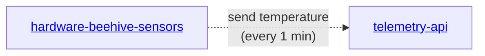

# hardware-beehive-sensors
A collection of code for IoT sensors for monitoring beehive on the edge devices, like ESP32

## Installation
- Install [DallasTemperature@3.9.0](https://github.com/milesburton/Arduino-Temperature-Control-Library) library in Arduino IDE (DallasTemperature@3.9.0
- Change configuration settings, have your own WIFI credentials
- Set API token that you can get from account settings at https://app.gratheon.com/account
- Set target hive Id (that you can take from URL, ex `https://app.gratheon.com/apiaries/7/hives/54` <-- ID is `54`)
- Compile and upload from Arduino IDE, observe how ESP32 measures and uploads the metrics

