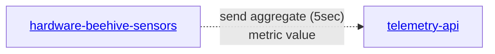

# hardware-beehive-sensors
A collection of code for IoT sensors for monitoring beehive on the edge devices, like ESP32

```mermaid
flowchart LR
	hardware-beehive-sensors[<a href="https://github.com/Gratheon/hardware-beehive-sensors">hardware-beehive-sensors</a>] -."send aggregate (5sec)\n metric value".-> telemetry-api[<a href="https://github.com/Gratheon/telemetry-api">telemetry-api</a>]
```
