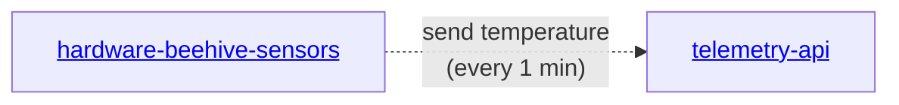

# hardware-beehive-sensors
A collection of code for IoT sensors for monitoring beehive on the edge devices, like ESP32

## Installation
- Install Dallas Temperature library in Arduino IDE
  DallasTemperature@3.9.0
  https://github.com/milesburton/Arduino-Temperature-Control-Library