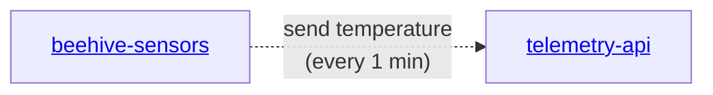

# gratheon/beehive-sensors
A collection of code for IoT sensors for monitoring beehive on the edge devices, like ESP32.
See [product vision](https://gratheon.com/about/products/%F0%9F%8C%A1%EF%B8%8F%20Beehive%20IoT%20sensors/),
[tech docs](https://gratheon.com/docs/beehive-sensors/) on the installation and wiring

