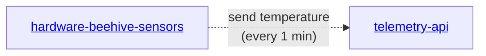

# hardware-beehive-sensors
A collection of code for IoT sensors for monitoring beehive on the edge devices, like ESP32




## Assembly
See [Notion](https://gratheon.notion.site/Bill-of-Materials-IoT-bd5472babeb94957886bafd9b46c92ec) for full list of materials.

### Temperature sensor DS18B20
```
                +-------------+
                |   ESP32     |
                |             |
                |   3.3V -----+------ VCC    (DS18B20)
                |   GND  -----+------ GND    (DS18B20)
                |   GPIO4 ----+------ DQ     (DS18B20)
                +-------------+
```


## Installation
- Install [DallasTemperature@3.9.0](https://github.com/milesburton/Arduino-Temperature-Control-Library) library in Arduino IDE (DallasTemperature@3.9.0
- Use Arduino IDE to compile and upload the code to ESP32
- Power on ESP32
- Connect to the ESP32 WIFI network (gratheon), use password `gratheon`
- Open browser and navigate to `http://192.168.4.1`
- Enter your WIFI credentials
- Set target URL `https://telemetry.gratheon.com/metric/HIVE_ID?api_token=API_TOKEN`
  - replace `HIVE_ID` with your hive ID. You can take that you can take from URL, ex `https://app.gratheon.com/apiaries/7/hives/54` <-- ID is `54`
  - replace `API_TOKEN` with generate token from account settings at https://app.gratheon.com/account
- Click `Save` button. Your ESP32 will restart and connect to your WIFI network and start sending data to the telemetry API service


