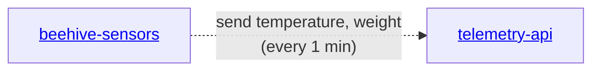
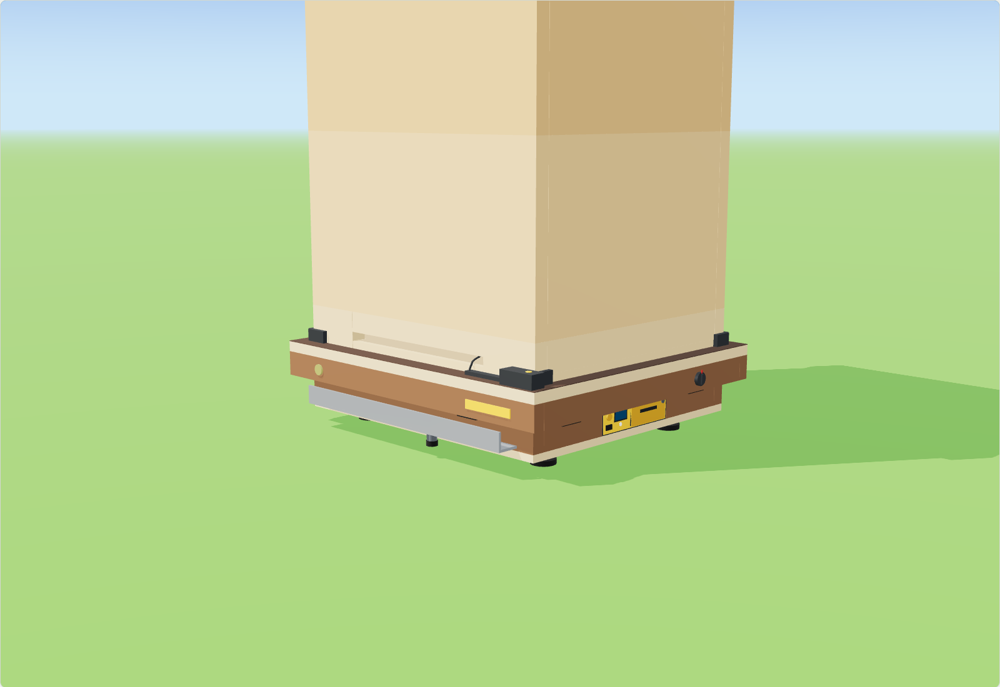

# gratheon/beehive-sensors
A collection of code for IoT sensors for monitoring beehive on the edge devices, like ESP32.
See [product vision](https://gratheon.com/about/products/%F0%9F%8C%A1%EF%B8%8F%20Beehive%20IoT%20sensors/),
[tech docs](https://gratheon.com/docs/beehive-sensors/) on the product, installation and wiring


```mermaid
flowchart LR
    beehive-sensors[<a href="https://github.com/Gratheon/beehive-sensors">beehive-sensors</a>] -."send temperature, weight <br /> (every 1 min)".-> telemetry-api[<a href="https://github.com/Gratheon/telemetry-api">telemetry-api</a>]
```

## Beehive scale (Phase 3 production kit)
A plywood and thermo-pine stand under the hive with one AP62AFB single-point load cell, an IP67 ESP32-S3 pod flush in its side (display, button, USB-C, 2–4 × 18650 cartridge) and a temperature + humidity probe that goes in through the entrance. It runs on batteries; cabling stays inside the base; small parts are 3D printed. The [Entrance Observer](https://github.com/Gratheon/entrance-observer) stands on its front rail and powers it over one M12 lead, and the same scale bolts into the [Robotic Beehive](https://github.com/Gratheon/robotic-beehive) plinth.

[](https://gratheon.com/products/scales/)

- **3D model:** open `model/index.html` (self-contained, works offline) or see [gratheon.com/products/scales](https://gratheon.com/products/scales/). `model/beehive-scale.glb` has the exploded-view animation.
- **Design principles:** shared by all Gratheon hardware: [hardware design principles](https://gratheon.com/docs/hardware-design-principles/)
- **Docs:** [product description](https://gratheon.com/docs/beehive-sensors/product-description/), [bill of materials](https://gratheon.com/docs/beehive-sensors/bill-of-materials/), [production wiring](https://gratheon.com/docs/beehive-sensors/#wiring)

The model lives in `model/scale-model.js`; the viewer is `viewer.js`, `viewer.html` and `viewer.css`. After a change, rebuild:
```bash
cd model && npm install   # first time only
npm run build             # regenerates index.html and beehive-scale.glb
npm run preview           # renders docs/preview*.png (headless Chrome)
npm run website           # also updates the embeds on gratheon.com (../../gratheon.com)
```

## Features
- serves as a web server on a dedicated WiFi access point (gratheon) to configure the sensor when first booted or after reset button is pressed
- on submit, stores the configuration in the persistent storage (EEPROM) in case of power loss
- every 1 minute sends the telemetry data (temperature) to the cloud (telemetry-api)
- sleeps most of the time to save energy
- blinks LED when active
